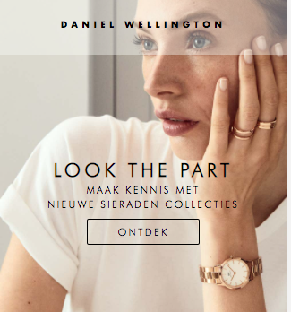
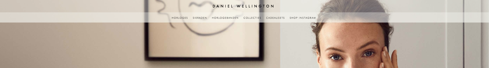
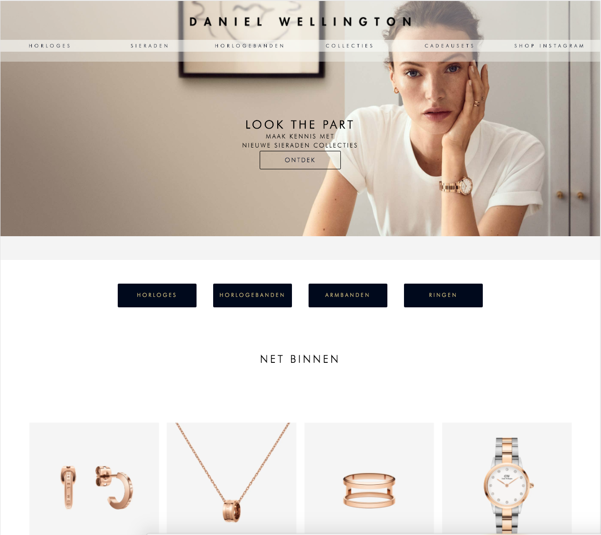
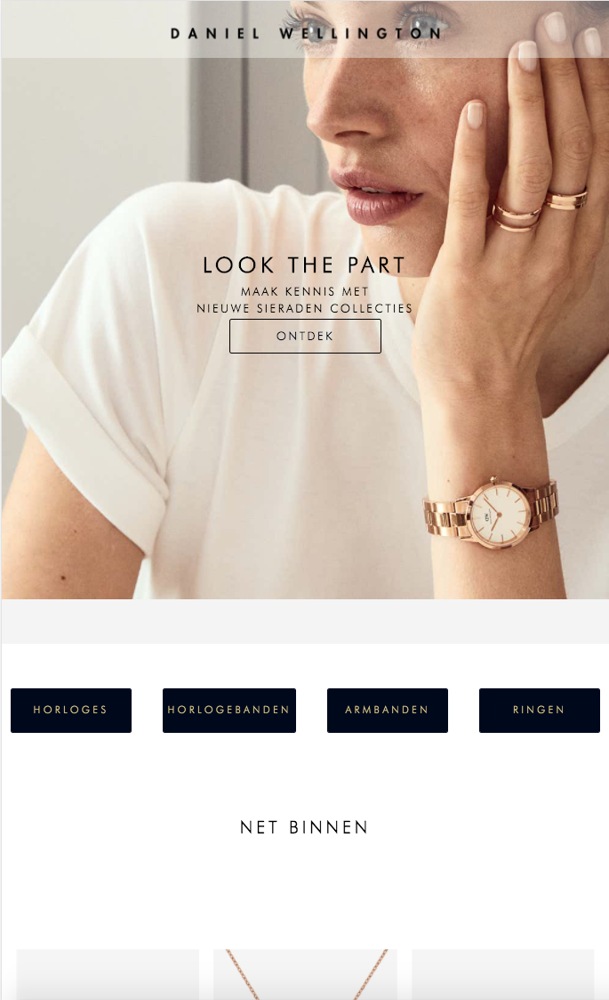

# Procesverslag
**Auteur:** -jouw naam-

Markdown cheat cheet: [Hulp bij het schrijven van Markdown](https://github.com/adam-p/markdown-here/wiki/Markdown-Cheatsheet). Nb. de standaardstructuur en de spartaanse opmaak zijn helemaal prima. Het gaat om de inhoud van je procesverslag. Besteedt de tijd voor pracht en praal aan je website.

## Bronnenlijst
1. -bron 1-
2. -bron 2-
3. -...-

## Eindgesprek (week 7/8)

-dit ging goed & dit was lastig-

**Screenshot(s):**

-screenshot(s) van je eindresultaat-

## Voortgang 3 (week 6)

### Stand van zaken

Ik heb deze week minder gedaan dan had ik had gewild. Dat heeft voornamelijk te maken met het feit dat ik mijn tijd moest verdelen over deadlines voor anderen vakken.

Ik heb wel de structuur van mijn html aangepast en voor mijn gevoel is dat een stuk schoner en meer semantisch dan voorheen.
Ik ben begonnen aan het maken van mijn menu voor mobile. Desktop had ik al af maar mobile nog niet. Ik merk dat ik het echt heel erg lastig vind om een keuze te maken in hoe ik het mobile menu wil realiseren. Dit komt omdat ik mijn hamburger menu zo wil maken dat mijn html structuur semantisch blijft. Ik ben aan het twijfelen of ik het hamburger menu moet maken met javascript maar dan loop ik er tegenaan dat het menu niet toegankelijk is als javascript niet runt en, ik waarschijnlijk classes moet toevoegen met javascript. Echter, als ik het mobile menu maak met html en css dan zal ik html elementen moeten toevoegen die puur en alleen worden toegevoegd om in css het hamburger icoontje te maken. Als ik (als op de originele website) svg icons ga toevoegen dan is dit weer niet toegankelijk voor screenreaders.
Ik heb dus echt wat hulp nodig om een beslissing te maken en dit wil ik ook vragen in het volgende en laatste voortgangsgesprek.

Een ander probleem is dat Daniel Wellington het een en ander heeft aangepast op de website. Gelukkig heb ik een aantal screenshots van de oude layout maar niet van alles. Ik zal dus een combinatie moeten maken van wat ik al heb en wat ze inmiddels hebben aangepast.

**Screenshot(s):**

### Agenda voor meeting

- vraag over het toevoegen van een hamburger menu met een css animation in semantische html opmaak.

## Voortgang 2 (week 5)

### Stand van zaken

Waar ik sta
Deze week heb ik een beetje vertraging opgelopen. Ik heb mijn eerste pagina bijna volledig responsive. Ik heb de html voor mijn tweede pagina af en ben begonnen om die ook te stylen. moet voor beide pagina's de disclaimer nog toevoegen.

Dit was Lastig
Ik vond het lastig om met flexbox te werken omdat ik een maximale breedte moest geven aan de mijn flex items en de container en ze moest centeren. Het het uiteindelijk voor elkaar gekregen door een flexbox te nesten en ik heb een div gebruikt. Ben er niet helemaal zeker van of dit ook de juiste aanpak is voor wat ik wilde bereiken.

Ook blijf ik het lastig vinden om tekst te positioneren op een img en die bij het schalen op dezelfde plek te houden. Zelfs met de container op relative en de tekst op absolute met percentages wil dit niet altijd lukken en ik begrijp niet waarom.

Het stylen van geneste sections is nog een probleem. geneste sections krijgen dezelfde style als mijn andere sections. zelfs als ik ze apart declareer. Ik heb het nu het probleem dat beide sections van elkaar styling krijgen.

Dit ging goed
Ik begin handig te worden in het gebruiken van de dev tool. Dit maakt het een stuk eenvoudiger om fouten in mn code te vinden en ze sneller op te lossen.

**Screenshot(s):**

### Agenda voor meeting

- vraag over responsive positioneren
- vraag over nesten van flexbox
- vraag over DOM elementen in footer. Toevoegen met mediaqueries of javascript???
- vraag over een maximale breedte op mijn flex-item (schaalt nog niet goed mee)
- vraag over geneste sections stylen (hoe kan ik de style overschrijven?)

### Verslag van meeting

Meeting ging goed! Ik heb helder gekregen wat ik precies moet aanpassen aan de structuur van m'n html. Ik ga daar deze week mee aan de slag maar ben bang dat ik er minder tijd in kan steken dat de afgelopen weken omdat ik ook deadlines heb voor andere vakken.

## Voortgang 1 (week 3)

### Stand van zaken

responsive layout maken zonder mediaqueries vond ik lastig maar gaat steeds beter oefeningen van de afgelopen weken hebben me goed geholpen met het positioneren van elementen. dit ging redelijk goed.

**Screenshot(s):**

### Agenda voor meeting

wil het graag hebben over responsive positioneren

### Verslag van meeting

De meeting ging snel en ik merkte dat ik niet helemaal duidelijk had voor mezelf waar ik tegen aan liep omdat ik vond dat ik er zelf nog even mee bezig moest zijn voordat ik vragen kon stellen. Voor de volgende meeting wil ik de dingen waar ik tegen aan loop opschrijven zodat ik meer uit de meeting kan halen.

## Intake (week 1)

**Je startniveau:** blauw

**Je focus:** responsive

**Je opdracht:** https://www.danielwellington.com/nl/

**Screenshot(s):**

![screenshot(s) die een goed beeld geven van de website die je gaat maken]

**Breakdown-schets(en):**

  
